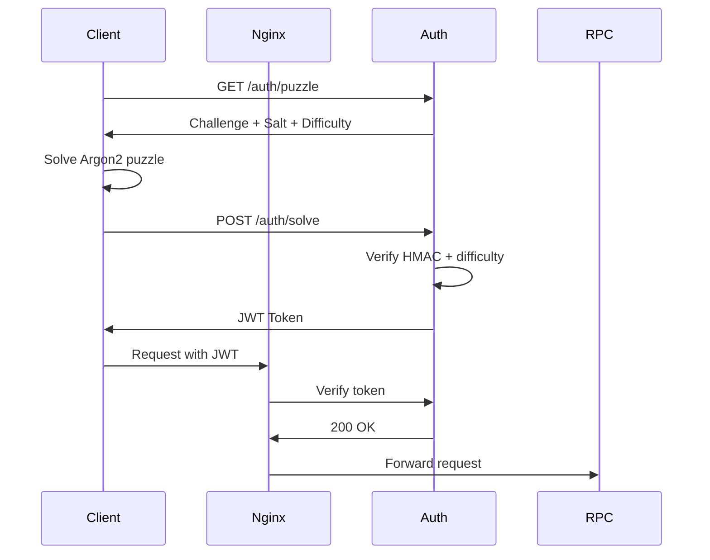

# Go Auth Service

Proof-of-work authentication service that protects RPC endpoints from DDoS attacks using Argon2-based puzzles.

## Quick Start

### Start the Service
```bash
go build -o auth-server ./auth/cmd/server
PORT=8081 ./auth-server
```

Or using the Makefile:
```bash
make build-server
PORT=8081 ./bin/auth-server
```

### Configure Nginx

```nginx
location /auth {
    proxy_pass http://go-auth-service:8081;
}

location /protected-rpc {
    auth_request /auth/verify;
    proxy_pass http://your-rpc-backend;
}
```

## How It Works



## Configuration

Edit `auth_config.json`:

```json
{
  "algorithm": "argon2id",
  "jwt_secret": "your-secret-key",
  "puzzle_difficulty": 2,
  "requests_per_token": 100,
  "token_expiry_minutes": 10,
  "argon2_params": {
    "memory_kb": 65536,
    "time": 5,
    "threads": 2,
    "key_len": 32
  }
}
```

**Key parameters:**
- `puzzle_difficulty`: Leading zeros required (1=easy, 3=hard)
- `argon2_params.time`: Hash iterations (higher = slower)
- `argon2_params.memory_kb`: Memory per hash (ASIC resistance)

## Testing

```bash
make build-test-auth
./bin/test-puzzle-auth http://localhost:8081
```

## API Endpoints

- `GET /auth/puzzle` - Get proof-of-work challenge
- `POST /auth/solve` - Submit puzzle solution
- `POST /auth/verify` - Verify JWT token (for nginx)
- `GET /auth/status` - Service health status
- `GET /dev/test-solve` - Test solution (development)

## Environment Variables

- `PORT` - Service port (default: 8081)
- `CONFIG_FILE` - Config path (default: auth_config.json)

## License

See [LICENSE](LICENSE) file for details.
