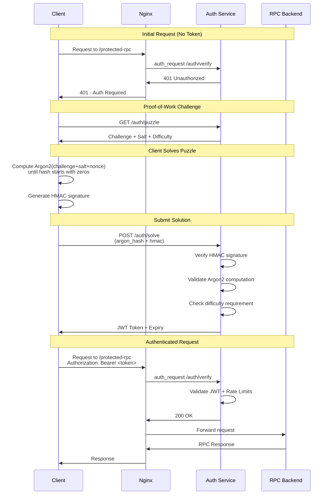

# Go Auth Service

A high-performance proof-of-work authentication service designed to protect RPC endpoints from DDoS attacks using Argon2-based puzzles with HMAC verification.

## 🎯 **Purpose**

This service protects RPC endpoints from DDoS attacks by requiring clients to solve computationally expensive proof-of-work puzzles. Clients must find an Argon2 hash with a specific prefix (leading zeros) through brute force iteration. Argon2 is memory-hard and more resistant to parallelization than SHA256, making it ideal for anti-DDoS protection while remaining easily verifiable by the server.

## 🚀 **Usage Scenario**

### 1. **Start the Service**
```bash
go build -o server ./cmd/server
PORT=8081 ./server
```

### 2. **Configure Nginx**
Add authentication sections to your nginx configuration:

```nginx
location /auth {
    proxy_pass http://go-auth-service:8081;
}

location /protected-rpc {
    auth_request /auth/verify;
    proxy_pass http://your-rpc-backend;
}
```

### 3. **Client-Server Flow**

**Server Challenge (GET /auth/puzzle):**
```json
{
  "challenge": "a1b2c3d4e5f6...",
  "salt": "f6e5d4c3b2a1...",
  "difficulty": 2,
  "expires_at": "2024-01-01T12:00:00Z",
  "argon2_params": {
    "memory_kb": 65536,
    "time": 5,
    "threads": 2,
    "key_len": 32
  }
}
```

**Client Solution (POST /auth/solve):**
```json
{
  "challenge": "a1b2c3d4e5f6...",
  "salt": "f6e5d4c3b2a1...",
  "nonce": 12345,
  "argon_hash": "00a1b2c3d4e5f6...",
  "hmac": "sha256_hmac_signature",
  "expires_at": "2024-01-01T12:00:00Z"
}
```

**Server Response:**
```json
{
  "token": "eyJhbGciOiJIUzI1NiIs...",
  "expires_at": "2024-01-01T12:10:00Z",
  "request_limit": 100
}
```

### 4. **HMAC Verification**

The server uses HMAC-SHA256 to verify that:
- The puzzle solution was generated by the legitimate server
- The Argon2 hash hasn't been tampered with
- Prevents hash forgery attacks

### 5. **JWT Token Validation**

When nginx forwards requests to `/auth/verify`:
- **Valid token**: Returns HTTP 200, request proceeds
- **Invalid/expired token**: Returns HTTP 401, request blocked
- **Rate limit exceeded**: Returns HTTP 429, request blocked

## ⚙️ **Configuration**

Edit `auth_config.json` to adjust difficulty:

```json
{
  "algorithm": "argon2id",
  "jwt_secret": "your-secret-key",
  "puzzle_difficulty": 2,
  "requests_per_token": 100,
  "token_expiry_minutes": 10,
  "argon2_params": {
    "memory_kb": 65536,
    "time": 5,
    "threads": 2,
    "key_len": 32
  }
}
```

### **To Increase Computation Time:**

1. **Increase `puzzle_difficulty`**: More leading zeros required (exponential difficulty)
    - `difficulty: 1` → ~16 attempts avg
    - `difficulty: 2` → ~256 attempts avg
    - `difficulty: 3` → ~4096 attempts avg

2. **Increase `argon2_params.time`**: More Argon2 iterations per attempt
    - `time: 3` → ~100ms per hash
    - `time: 5` → ~200ms per hash
    - `time: 10` → ~400ms per hash

3. **Increase `argon2_params.memory_kb`**: More memory required (ASIC resistance)
    - `memory_kb: 32768` → 32MB per hash
    - `memory_kb: 65536` → 64MB per hash
    - `memory_kb: 131072` → 128MB per hash

## 📊 **Process Flow**



## 🧪 **Testing**

Run the complete test suite:

```bash
./test_go_auth.sh
```

This will:
- Build and start the service
- Get a puzzle challenge
- Solve the puzzle (measures solve time)
- Submit solution and receive JWT token
- Verify token authentication
- Test rate limiting

## 🛡️ **Security Features**

- **HMAC Protection**: Prevents hash forgery attacks
- **Argon2id Algorithm**: Memory-hard, ASIC-resistant
- **JWT Authentication**: Stateless token verification
- **Rate Limiting**: Configurable request limits per token
- **Expiration Handling**: Automatic token and puzzle expiry

## 📋 **API Endpoints**

- `GET /auth/puzzle` - Get proof-of-work challenge
- `POST /auth/solve` - Submit puzzle solution
- `POST /auth/verify` - Verify JWT token (for nginx)
- `GET /auth/status` - Service health status
- `GET /dev/test-solve` - Generate test solution (development only)

## 🏗️ **Deployment**

### Environment Variables:
- `PORT` - Service port (default: 8081)
- `CONFIG_FILE` - Config file path (default: auth_config.json)
